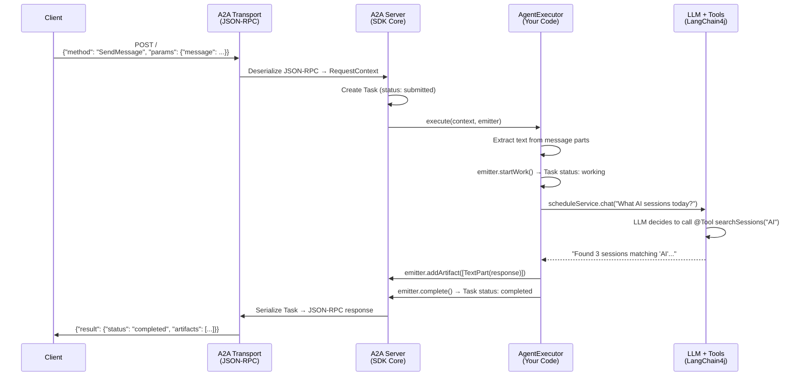
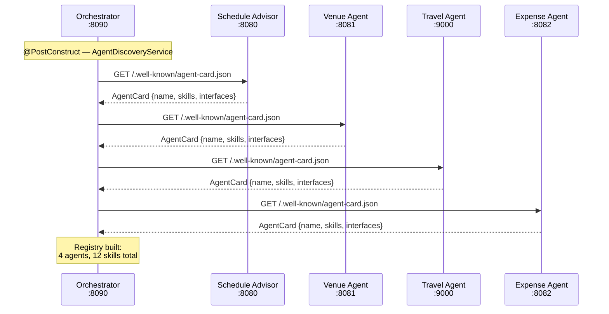
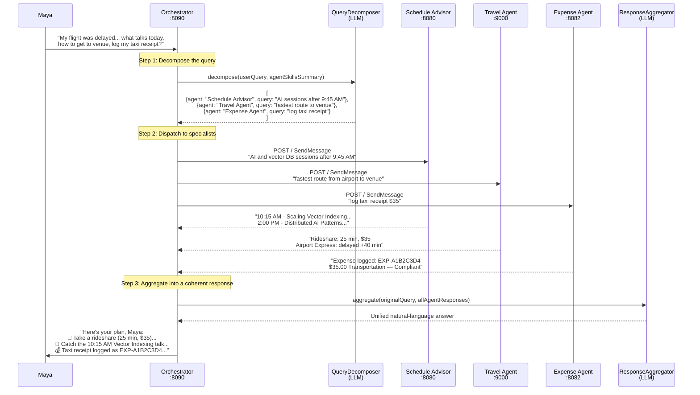
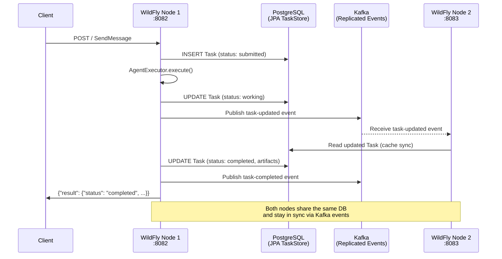

# Building the DevSphere Concierge — A Multi-Agent A2A Ecosystem

A 2-hour hands-on lab that takes you from zero to a fully orchestrated, multi-runtime, multi-language, observable agent mesh using the **A2A protocol**, **LangChain4j**, and the **A2A Java SDK**.

## The Story

DevConf 2026 is next week and 5,000 attendees need help navigating the conference. You're building **DevSphere** — an AI-powered concierge mesh of specialized agents that collaborate via A2A to answer any attendee question, from session recommendations to travel logistics to expense reporting.

### The Scenario: "The Flight Delay & Keynote Clash"

It is 8:15 AM on Day 1. Maya lands at the airport, but her flight was delayed by two hours. She opens her DevSphere app and types:

> *"My flight was delayed so I missed the morning shuttle. I'm interested in agentic AI and Java agents—what talks should I catch today, how do I get to the venue quickly, and can you log my taxi receipt?"*

Here's how the mesh resolves her request in real-time:

1. **Edge Routing & Decomposition** — The Quarkus Orchestrator parses Maya's intent, inspects the active AgentCard registry, and splits the prompt into sub-tasks
2. **Travel & Transit** — The Python Travel Agent compares transit options and determines a rideshare is 20 min faster than the delayed airport express train
3. **Session Matching** — The Quarkus Schedule Advisor filters out morning sessions (Maya arrives at 9:45 AM) and finds a 10:15 AM session on "Scaling Vector Indexing in Enterprise Meshes"
4. **Venue Check** — The Spring Boot Venue Agent checks Hall B's real-time IoT sensors, confirms 60% capacity, and reserves a fast-track entry pass
5. **Expense Log** — The WildFly Expense Agent processes Maya's taxi receipt into an audit-ready reimbursement entry

Each exercise adds a new agent to the mesh. By the end, you'll have the complete DevSphere system.

## Architecture

```
                              User (Maya)
                                  |
                       ┌──────────▼──────────┐
                       │  Orchestrator &      │
                       │  Concierge           │
                       │  (Quarkus) :8090     │
                       └──────────┬───────────┘
                                  │
              ┌───────────────────┼───────────────────┐
              │                   │                   │
    ┌─────────▼────────┐ ┌───────▼───────┐ ┌─────────▼────────┐
    │ Schedule &        │ │ Venue &       │ │ Travel &         │
    │ Content Advisor   │ │ On-Site Ops   │ │ Logistics Agent  │
    │ (Quarkus) :8080   │ │ (Spring Boot) │ │ (Python) :9000   │
    └──────────────────┘ │ :8081          │ └──────────────────┘
                         └───────────────┘
              ┌──────────────────┐
              │ Expense &        │
              │ Compliance Agent │
              │ (WildFly         │
              │  Enterprise)     │
              │ :8082            │
              └──────────────────┘

All agents: AgentCard + JSON-RPC + A2A SDK
All traces: OpenTelemetry → Grafana/Tempo (:3000)
```

| Port | Agent | Runtime | A2A SDK |
|------|-------|---------|---------|
| 8080 | Schedule & Content Advisor | Quarkus | `a2a-java-sdk-reference-jsonrpc` |
| 8081 | Venue & On-Site Operations | Spring Boot | `a2a-java-sdk-reference-jsonrpc` |
| 9000 | Travel & Logistics | Python | `a2a-sdk` (Python) |
| 8090 | Orchestrator & Concierge | Quarkus | `a2a-java-sdk-reference-jsonrpc` + `a2a-java-sdk-client` |
| 8082 | Expense & Compliance | WildFly 41 (Enterprise) | `a2a-jakarta-jsonrpc` + JPA + Kafka |

## How It All Works

### Sequence 1: Single Agent Request

When a client sends a message to any agent, this is the flow through the A2A SDK:



### Sequence 2: Agent Discovery (Orchestrator Startup)

Before the Orchestrator can route requests, it discovers all specialist agents:



### Sequence 3: Maya's Full Scenario (Orchestrated Multi-Agent)

This is the complete flow when Maya sends her complex query:



### Sequence 4: Enterprise Agent (Exercise 4 — JPA + Kafka)

The Expense Agent uses enterprise features for production-grade persistence and multi-node support:



## Prerequisites

- **JDK 21+** (e.g., Temurin, GraalVM)
- **Maven 3.9+**
- **Python 3.11+** with `pip` or `uv`
- **Podman** with `podman-compose`
- **curl** or **httpie** for testing
- A terminal with at least 4 tabs/panes
- An OpenAI API key with API billing enabled. ChatGPT subscriptions do not cover API usage, and the GPT-6 Luna API Free tier is unsupported.

## Quick Start

```bash
# 1. Clone the repo
git clone <repo-url>
cd a2a-agent-lab-2026

# 2. Start infrastructure (Grafana LGTM)
podman-compose -f exercises/exercise-5-orchestrator/podman-compose.yml up -d

# 3. Set your OpenAI API key (used with gpt-6-luna at medium reasoning effort)
export OPENAI_API_KEY=your-api-key-here

# 4. Verify
open http://localhost:3000                     # Grafana UI (admin/admin)
```

## Exercises

| # | Exercise | Time | What You Build | Runtime |
|---|----------|------|----------------|---------|
| 1 | [Your First A2A Agent](exercises/exercise-1-schedule-advisor/) | 30 min | Schedule & Content Advisor | Quarkus + `@RegisterAiService` |
| 2 | [Cross-Runtime Agents](exercises/exercise-2-venue-agent/) | 20 min | Venue & On-Site Operations | Spring Boot + LangChain4j |
| 3 | [Cross-Language Interop](exercises/exercise-3-travel-agent-python/) | 15 min | Travel & Logistics Agent | Python A2A SDK |
| 4 | [Enterprise Day-2](exercises/exercise-4-expense-agent/) | 20 min | Expense & Compliance Agent + OpenTelemetry | WildFly 41 Enterprise (JPA + Kafka) |
| 5 | [The Orchestrator](exercises/exercise-5-orchestrator/) | 25 min | Orchestrator & Concierge | Quarkus + Multi-Agent |

Each exercise adds a new agent to the DevSphere mesh. If you fall behind, check the `solutions/` directory for complete working code at each checkpoint.

## The Agents

### The Orchestrator & Concierge (Quarkus)
The primary edge router and user-facing gateway. Leveraging Quarkus for sub-second cold starts and minimal memory overhead, it receives user prompts, inspects AgentCard schemas across the mesh, and orchestrates multi-agent tasks. Uses two `@RegisterAiService` beans — one to decompose queries into sub-tasks, another to aggregate multi-agent responses.

### The Schedule & Content Advisor (Quarkus)
Deep-scans the summit's session catalog, speaker bios, and domain tracks. Matches attendee skill levels and interests to specific talks. Uses Quarkus LangChain4j's `@RegisterAiService` with `@Tool`-annotated CDI beans for native LLM tool calling.

### The Travel & Logistics Agent (Python A2A SDK)
Connects to flight APIs, local transit, and hotel systems. Handles travel bookings, flight disruption monitoring, and commute routes to the venue. Built with the Python A2A SDK reference implementation.

### The Venue & On-Site Operations Agent (Spring Boot + LangChain4j)
Robust enterprise microservice that manages real-time IoT room capacity sensors, indoor interactive mapping, and catering queue tracking.

### The Expense & Compliance Agent (WildFly Enterprise)
Standardizes receipts and session attendance into corporate audit-ready expense logs. Deployed on WildFly 41 with enterprise-grade features: JPA-backed task persistence (PostgreSQL), push notification config store, and a Kafka-replicated queue manager for multi-node deployment. Supports multiple A2A transport protocols (JSON-RPC, REST, gRPC) via Maven profiles.

## Building

All Java exercises can be compiled at once from the root:

```bash
mvn compile
```

Or from the exercises directory:

```bash
cd exercises
mvn compile
```

## Key Technologies

- **[A2A Protocol](https://google.github.io/A2A/)** — Open standard for agent-to-agent communication
- **[A2A Java SDK](https://github.com/a2aproject/a2a-java-sdk)** — Java implementation of the A2A protocol
- **[LangChain4j](https://docs.langchain4j.dev/)** — Java framework for LLM-powered applications
- **[A2A Jakarta EE SDK](https://github.com/wildfly-extras/a2a-jakarta)** — A2A integration for Jakarta EE / WildFly
- **[Quarkus](https://quarkus.io/)** — Supersonic Subatomic Java framework
- **[Spring Boot](https://spring.io/projects/spring-boot)** — Java application framework
- **[WildFly](https://www.wildfly.org/)** — Jakarta EE application server
- **[OpenAI API](https://developers.openai.com/api/docs/models/gpt-6-luna)** — GPT-6 Luna via the Responses API
- **[OpenTelemetry](https://opentelemetry.io/)** — Observability framework
- **[Grafana LGTM](https://grafana.com/blog/2024/03/13/an-opentelemetry-backend-in-a-docker-image-introducing-grafana/otel-lgtm/)** — All-in-one observability stack (Loki + Grafana + Tempo + Mimir)
